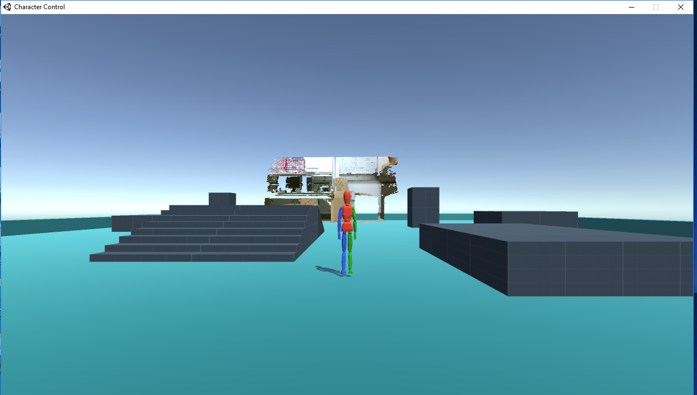

# 2017 Fall Multimedia Systems CS6331
Instructor: **Dr. B. Prabhakaran**

This course is to understand how different media data -- such as text, audio, images, video (both 2D and 3D video), haptics, and 3D graphics -- can be stored, queried, and delivered.   
Subjects include media characteristics, operating system, metadata generation, indexing techniques, query languages, streaming media, security and privacy, etc.

## What's inside the folder
This folder contains the source code for the final project of the course.

- `Result` folder contains the result of the project.  
There is a `Multipj.exe` file generated by Unity3D. Please run it on a Windows-based environment.  
Please refer to the instructions in `Readme.txt` in the folder on how to manipulate the robot character.  
Other folders and files inside this folders are necessary tools and dependency files.

- `Resources` folder contains useful dataset and scripts of the project.  
The section number at the beginning of every folder name corresponds to the actual section of the `ProjectReport.pdf`. Please refer to this pdf file for detail.

- `ProjectReport.pdf` is the detailed report for the project.

- `project.png` is the snapshot of the result of the project.

## Project: 3D Robot Control in a 3D Scene Generated from RGB-D Image
C++ / OpenCV / PCL (Point Cloud Library) / Ubuntu / C# / Unity3D / Desktop Application

The project is to to use a RGB-D dataset to visualize a 3D scene, and then render a robot model in this scene. We can control the robot to make it move to a marker position. The robot will be made animated and will be with sound effects when moving.

This project is a comprehensive project and involves many different tools and concepts at once, including: C++, C#, OpenCV, Point Cloud Library, Ubuntu System, CMake, MeshLab,
Unity5, blender, etc.

Detailed description is in `ProjectReport.pdf`

## How to run the code
Due to the huge size, the whole original project folder under Unity workspace is not uploaded.  
Please refer to the `Result` folder to run the exported ultimate `.exe` file.
